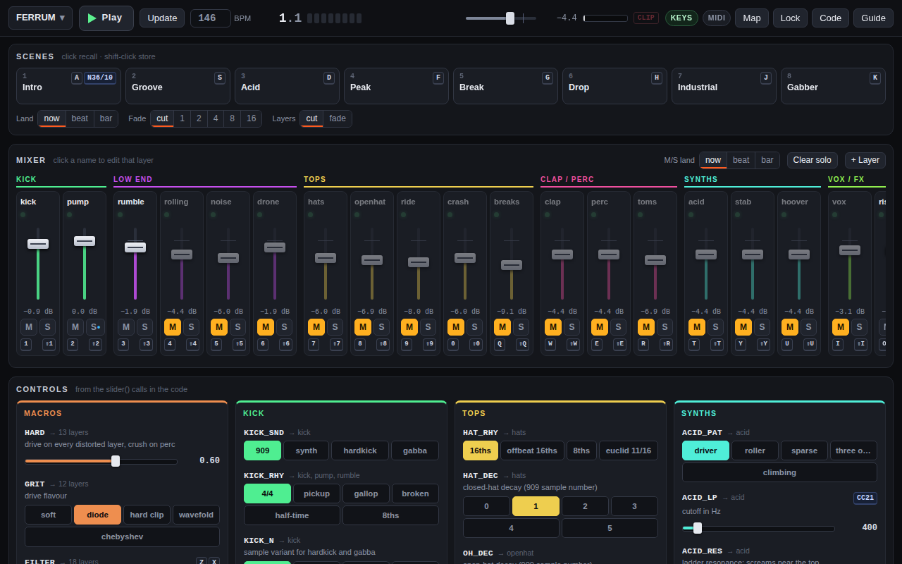

# Strudel Deck

A performance surface for [Strudel](https://strudel.cc) code. It reads your code and builds a mixing desk from it: every labelled pattern gets a channel strip (fader, mute, solo, activity light), every `slider()` becomes a control, and the sections in your comments become sections on the deck. Change the code and press Update; the deck follows. Nothing is tied to one song.



- **Mixer**: faders, mute, solo, solo-safe layers, last sound per layer, output meter with clip light.
- **Controls**: sliders, switches with named positions, steppers with a dice for seeds. Every change is written back into the code.
- **Scenes**: store the whole state in 8 slots; recall now, on the beat or on the bar, with fades of 1–16 bars.
- **Keys and MIDI**: default keys for everything, and a Map mode to bind any key (toggle or hold) or MIDI knob, fader, pad or button.
- **Layer view**: open one layer's code on its own, listen to it alone, change it and apply without stopping. Lists the controls and functions it uses.
- **Guide**: how the deck reads code, a primer on Strudel concepts for this kind of music, a searchable reference of 445 Strudel functions with runnable examples, and links to the official workshop.
- **Songs**: saved in the browser per song (code, mixer, scenes, mappings). Export and import as files; open the current state in strudel.cc.

Ships with **FERRUM**, a hard industrial techno set (20 layers, 37 controls, 8 scenes), and a small **Starter** song to copy from.

## Use it

**https://sueivan235-lgtm.github.io/strudel-deck/** in Chrome or Edge (Web MIDI needs one of those). Press Play. The first run downloads samples from GitHub, so give it a few bars.

To run it locally:

```sh
npm install
npm run build          # writes the site to docs/
python3 -m http.server -d docs 8080   # then open http://localhost:8080
```

## How the deck reads code

| Code | On the deck |
| --- | --- |
| `kick: s("bd*4")` | a layer: channel strip called kick |
| `_kick: …` | Strudel's off switch; the strip shows "off in code" with a button to turn it on |
| `Skick: …` | Strudel's solo in code (so don't start layer names with a capital S) |
| `const CUT = slider(800, 100, 5000)` | a control called CUT; use it anywhere, e.g. `.lpf(CUT)` |
| `slider(0, 0, 3, 1) // a · b · c · d` | a switch with four named positions (separate names with `·` or `\|`) |
| `slider(0.5, 0, 1) // what it does` | any other trailing comment becomes the control's help text |
| `// ─── DRUMS ───` | starts a section (`// == DRUMS ==` and `// # Drums` work too) |

The deck also works out which controls each layer depends on, through constants and functions registered with `register()`, so hovering a strip highlights its controls and the layer view lists them.

## Default keys

| Key | Action |
| --- | --- |
| Space | play / stop |
| Shift+Enter | update (apply code changes) |
| 1–0, Q–P | mute layers 1–20 in strip order (Shift: solo) |
| A S D F G H J K | recall scenes 1–8 (Shift: store) |
| - and = | master down / up |
| arrow keys | move the selected control (Shift: fine) |
| Esc | leave the code editor, close popups |
| Ctrl/Cmd+Enter | in the code: evaluate and play (Strudel's shortcut) |

While the cursor is in the code, keys type code; press Esc to give them back to the deck. Map mode changes any of this per song.

## Good to know

- Browsers only allow sound after a click or key press on the page; the first one starts the audio. A MIDI message alone can't.
- Layer faders, mutes and solos act on a layer's next note, so a long pad keeps ringing until it retriggers. The master acts on the output directly.
- Edits made from the deck (layer view, rename, delete, off in code) carry a layer's fader, mute, scenes and key bindings along. For bindings that survive edits typed into the code, name your layers and give controls `const` names.
- Changes land slightly ahead of time (Strudel schedules about 0.1 s ahead). A scene recalled just before a bar line lands on the following bar.
- Imported songs are code and run like code on strudel.cc. Only import files you trust.
- Each song is saved under its own key in the browser, so two open tabs don't wipe each other's songs. Editing the same song in two tabs still overwrites; the deck warns when that happens.
- Safari has no Web MIDI; Firefox asks for permission. Chrome and Edge on a Mac are the tested setup.

## Development

```
src/engine.js      wraps Strudel's REPL (StrudelMirror): per-layer gain/mute/solo, time-aware slider values
src/store.js       values that change now, on the beat or bar, or ramp over bars
src/parse.js       static analysis of the code (acorn): sections, controls, layers, dependencies; code edits
src/deck.js        songs, mixer state, scenes, mappings, persistence
src/input.js       keyboard and Web MIDI
src/ui/            top bar, mixer, controls, scenes, layer view, map mode, guide
src/songs/         built-in songs (.strudel files) and their presets
src/guide/         guide texts and the generated function reference
scripts/make-reference.mjs   builds src/guide/reference.json from data/strudel-doc.json
```

```sh
npm test                           # unit tests + FERRUM equivalence check
python3 test/fetch_fixtures.py     # once: local copy of the samples the browser tests use
python3 test/e2e.py                # headless Chromium end-to-end test (needs Playwright)
python3 test/e2e_regressions.py    # audio unlock, undo, scene fades, races, keys under dialogs
node build.mjs --watch             # rebuild on change
```

`npm test` also checks that the deck version of FERRUM produces exactly the same events as the original single-file set, across every switch position.

## License

AGPL-3.0-or-later, like Strudel, whose packages this app bundles. The function reference is generated from Strudel's own documentation. Samples are loaded at runtime from [Dirt-Samples](https://github.com/tidalcycles/Dirt-Samples) and [dough-samples](https://github.com/felixroos/dough-samples).
